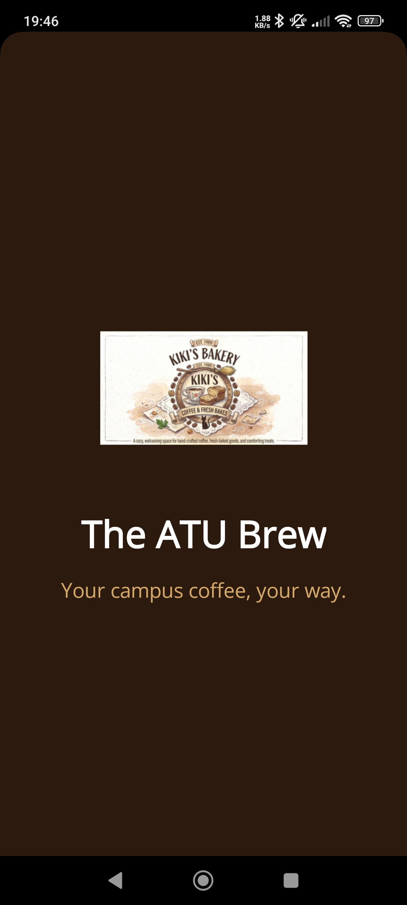
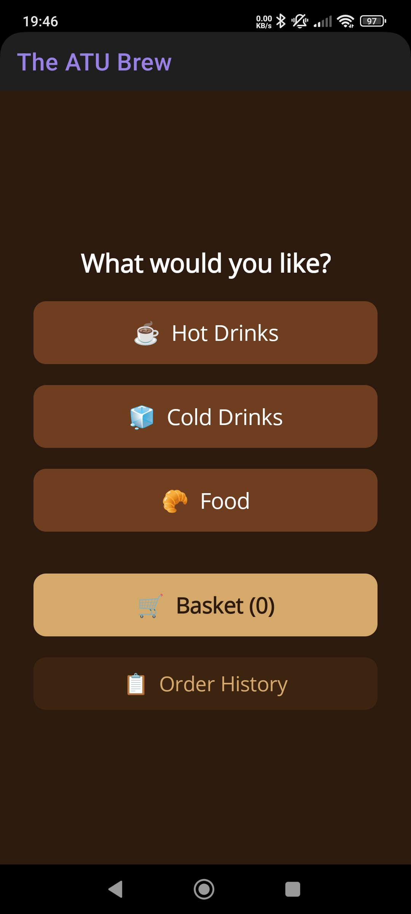
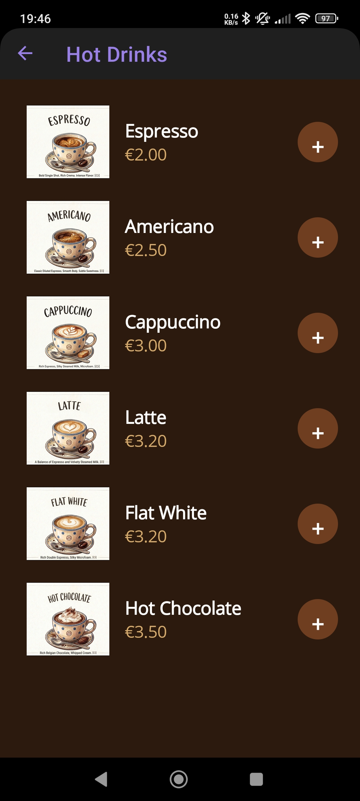
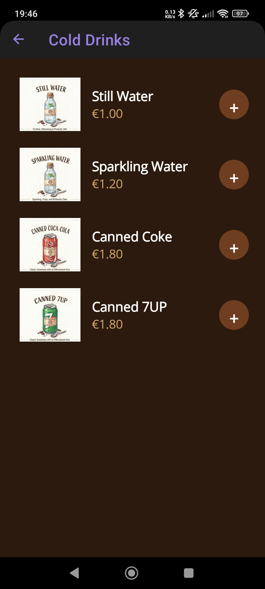
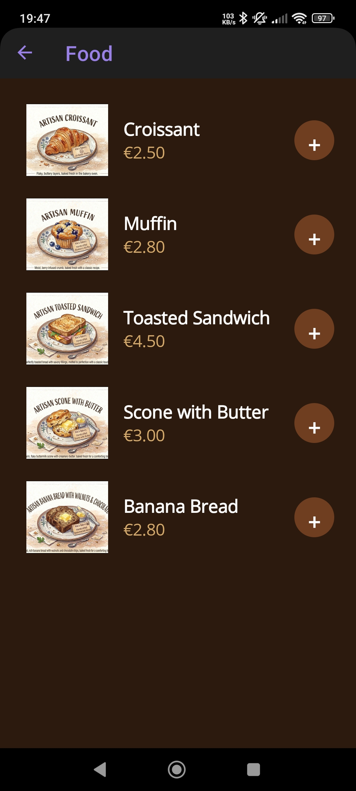
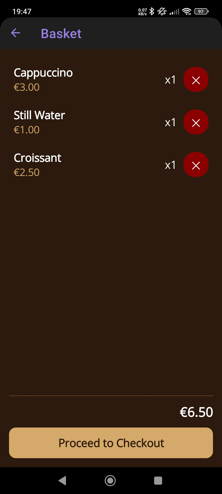
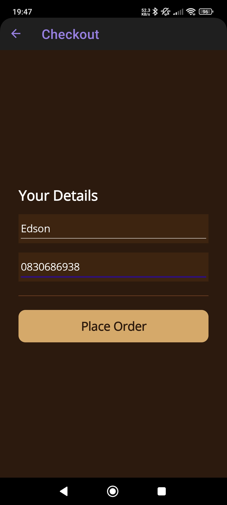
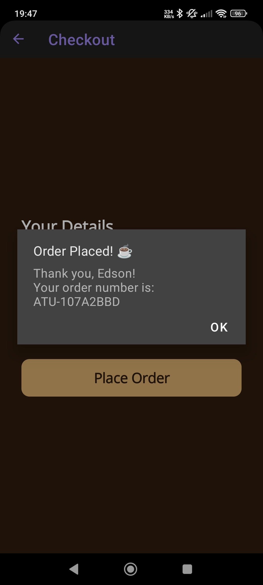
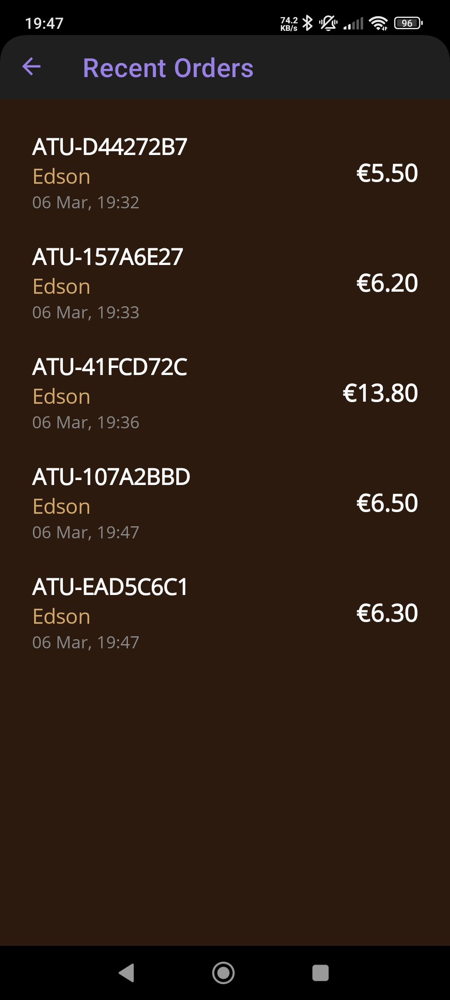
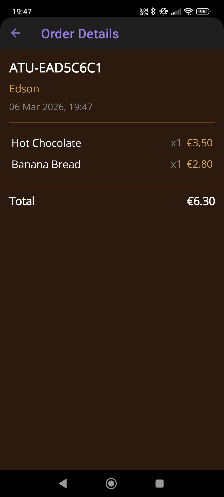

# The ATU Brew — App Walkthrough

A visual guide to the app's screens and user flow.

---

## 1. Splash Screen

On launch, the app displays the coffee shop logo and tagline for 2 seconds before navigating to the main menu.

---

## 2. Main Menu

The home screen lets the user choose a category to browse, open their basket, or view order history. The basket button shows the current item count.

---

## 3. Hot Drinks

Each menu page shows items with an image, name, and price. Tapping **+** adds the item to the basket — the button briefly flashes green to confirm.

---

## 4. Cold Drinks

---

## 5. Food

---

## 6. Basket

The basket lists all added items with their price and quantity. Each item can be removed with the red **×** button. The total updates in real time. Tapping **Proceed to Checkout** moves to the next step.

---

## 7. Checkout

The customer enters their name and phone number. These are saved automatically and pre-filled on the next order. The phone number is validated before the order is accepted.

---

## 8. Order Placed

After tapping **Place Order**, a confirmation dialog shows the customer's name and a unique order number (`ATU-XXXXXXXX`). The basket is cleared and the app returns to the main menu.

---

## 9. Order History

Shows all orders placed in the last 7 days, with order number, customer name, date, time, and total. Tap any order to see its items.

---

## 10. Order Details

Tapping an order in the history opens a detail view showing each item purchased, its quantity, subtotal, and the order total.

